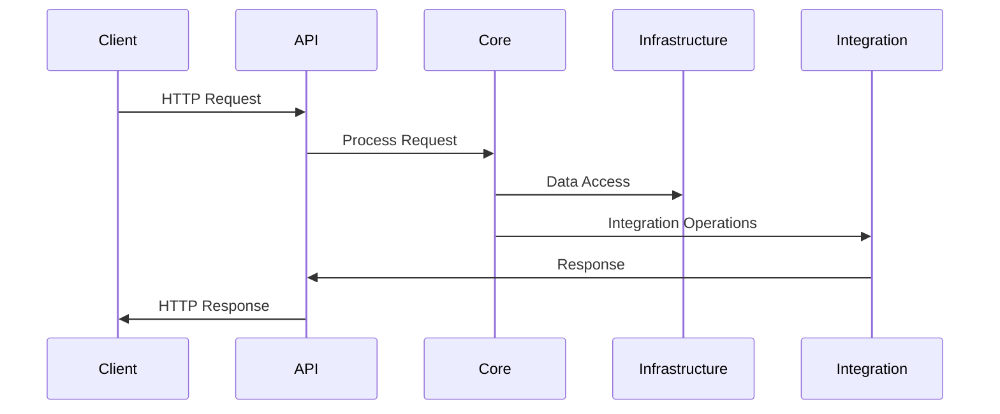
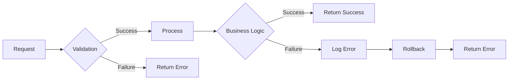
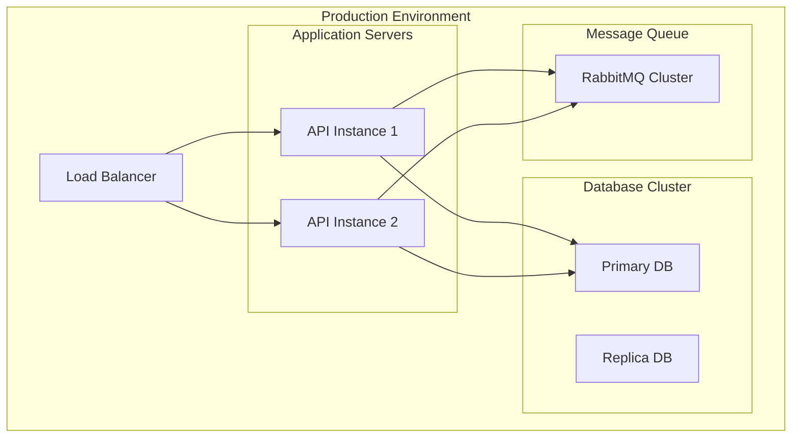

# Integration Platform Architecture

## Overview
The Integration Platform is designed as a modular, scalable system that handles various integration scenarios including file transfers, email communications, and monitoring capabilities.

## Architecture Diagram
```mermaid
graph TB
    subgraph "API Layer"
        API[API Project]
        Controllers[Controllers]
        Middleware[Middleware]
    end

    subgraph "Core Layer"
        Core[Core Project]
        BusinessLogic[Business Logic]
        Validators[Validators]
    end

    subgraph "Infrastructure Layer"
        Infrastructure[Infrastructure Project]
        Data[Data Access]
        Messaging[Messaging]
        ErrorHandling[Error Handling]
    end

    subgraph "Integration Services"
        SFTP[SFTP Service]
        Email[Email Service]
        Monitoring[Monitoring Service]
    end

    subgraph "Contracts"
        Contracts[Contracts Project]
        Interfaces[Interfaces]
        Models[Models]
    end

    API --> Core
    API --> Infrastructure
    API --> Integration Services
    Core --> Contracts
    Infrastructure --> Contracts
    Integration Services --> Contracts
```

## Component Design

### 1. API Layer (`IntegrationPlatform.Api`)
- **Controllers**: Handle HTTP requests and responses
- **Middleware**: 
  - Audit Trail Middleware
  - Error Handling Middleware
  - Request/Response Logging

### 2. Core Layer (`IntegrationPlatform.Core`)
- **Business Logic**: Core business rules and workflows
- **Validators**: Input validation using FluentValidation
- **Services**: Business service implementations

### 3. Infrastructure Layer (`IntegrationPlatform.Infrastructure`)
- **Data Access**:
  - Entity Framework Core
  - Dapper
  - Transaction Management
- **Messaging**:
  - RabbitMQ Integration
  - Message Publishing/Subscription
- **Error Handling**:
  - Error Logging
  - Error Tracking
  - Rollback Management

### 4. Integration Services
- **SFTP Service** (`IntegrationPlatform.SFTP`):
  - File Upload/Download
  - Directory Management
  - Connection Management

- **Email Service** (`IntegrationPlatform.Email`):
  - Email Sending
  - Attachment Handling
  - Email Retrieval

- **Monitoring Service** (`IntegrationPlatform.Monitoring`):
  - Activity Tracking
  - Metrics Collection
  - Log Management

### 5. Contracts (`IntegrationPlatform.Contracts`)
- **Interfaces**: Service contracts and abstractions
- **Models**: Data transfer objects and entities
- **Attributes**: Custom attributes for middleware

## Data Flow


## Error Handling Flow


## Security Considerations
1. **Authentication**: JWT-based authentication
2. **Authorization**: Role-based access control
3. **Data Protection**: Encryption at rest and in transit
4. **Audit Trail**: Comprehensive logging of all operations

## Scalability Features
1. **Horizontal Scaling**: Stateless design for easy scaling
2. **Caching**: Distributed caching support
3. **Message Queue**: Asynchronous processing via RabbitMQ
4. **Database**: Support for read replicas and sharding

## Monitoring and Logging
1. **Application Insights**: Performance monitoring
2. **Serilog**: Structured logging
3. **OpenTelemetry**: Distributed tracing
4. **Custom Metrics**: Business-specific metrics collection

## Deployment Architecture


## Development Guidelines
1. **Code Organization**:
   - Follow Clean Architecture principles
   - Maintain separation of concerns
   - Use dependency injection

2. **Testing Strategy**:
   - Unit tests for business logic
   - Integration tests for services
   - End-to-end tests for critical paths

3. **Documentation**:
   - API documentation using Swagger
   - Code documentation using XML comments
   - Architecture documentation

4. **Version Control**:
   - Feature branch workflow
   - Semantic versioning
   - Automated builds and deployments 