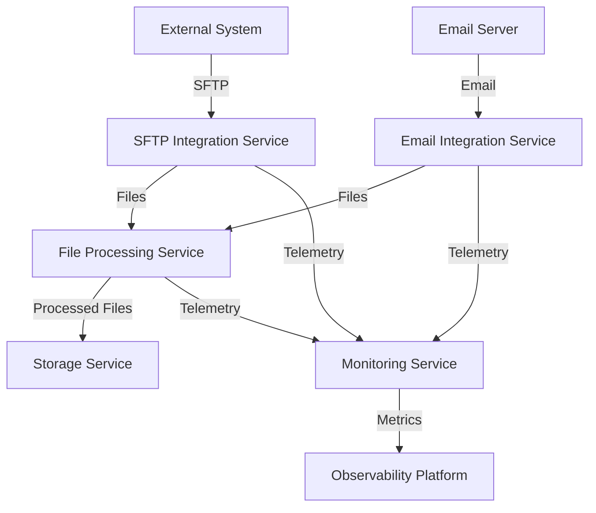
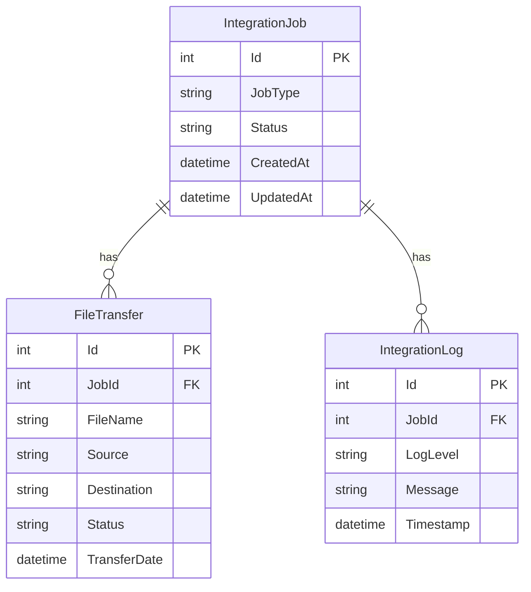

# Integration Platform Architecture

## Overview
This document outlines the architecture for a robust integration platform that handles third-party integrations via SFTP and email, with comprehensive monitoring and tracing capabilities.

## Architecture Options

### Option 1: .NET Microservices Architecture

#### Components
1. **Integration Gateway Service**
   - Handles all external communications
   - Implements circuit breakers and retry policies
   - Manages authentication and security

2. **SFTP Integration Service**
   - Manages SFTP connections and file operations
   - Handles certificate-based authentication
   - Implements file transfer protocols

3. **Email Integration Service**
   - Manages email communications
   - Handles email status checks
   - Processes email attachments

4. **File Processing Service**
   - Processes incoming/outgoing files
   - Implements file validation and transformation
   - Manages file storage

5. **Monitoring Service**
   - Collects telemetry data
   - Implements distributed tracing
   - Manages logging and diagnostics

#### Technology Stack
- .NET 8
- ASP.NET Core
- OpenTelemetry for tracing
- Serilog for logging
- Azure Application Insights
- Azure Key Vault for certificate management
- Azure Storage for file storage
- Azure Service Bus for messaging

### Option 2: .NET Aspire Architecture

#### Components
1. **Aspire Host**
   - Orchestrates all services
   - Manages service discovery
   - Handles configuration

2. **Integration Services**
   - SFTP Integration
   - Email Integration
   - File Processing
   - Monitoring

#### Technology Stack
- .NET Aspire
- .NET 8
- OpenTelemetry
- Azure Services
- Azure Key Vault
- Azure Storage
- Azure Service Bus

## Design Patterns

1. **Circuit Breaker Pattern**
   - Prevents cascading failures
   - Implements fallback mechanisms
   - Manages service resilience

2. **Retry Pattern**
   - Handles transient failures
   - Implements exponential backoff
   - Manages retry policies

3. **CQRS Pattern**
   - Separates read and write operations
   - Optimizes performance
   - Improves scalability

4. **Event Sourcing**
   - Tracks all changes
   - Enables audit trails
   - Supports replay capabilities

5. **Repository Pattern**
   - Abstracts data access
   - Implements caching
   - Manages data persistence

## Project Structure

```
src/
├── IntegrationPlatform/
│   ├── IntegrationPlatform.API/
│   ├── IntegrationPlatform.Core/
│   ├── IntegrationPlatform.Infrastructure/
│   ├── IntegrationPlatform.Domain/
│   └── IntegrationPlatform.Tests/
├── IntegrationPlatform.SFTP/
│   ├── IntegrationPlatform.SFTP.API/
│   ├── IntegrationPlatform.SFTP.Core/
│   └── IntegrationPlatform.SFTP.Tests/
├── IntegrationPlatform.Email/
│   ├── IntegrationPlatform.Email.API/
│   ├── IntegrationPlatform.Email.Core/
│   └── IntegrationPlatform.Email.Tests/
└── IntegrationPlatform.Monitoring/
    ├── IntegrationPlatform.Monitoring.API/
    ├── IntegrationPlatform.Monitoring.Core/
    └── IntegrationPlatform.Monitoring.Tests/
```

## Data Flow Diagram



## Database Schema



## Security Considerations

1. **Certificate Management**
   - Secure storage in Azure Key Vault
   - Regular rotation
   - Access control

2. **Authentication**
   - OAuth 2.0
   - JWT tokens
   - API keys

3. **Data Protection**
   - Encryption at rest
   - Encryption in transit
   - Data masking

## Monitoring and Observability

1. **Distributed Tracing**
   - OpenTelemetry integration
   - Correlation IDs
   - Span tracking

2. **Metrics**
   - Performance metrics
   - Business metrics
   - System health

3. **Logging**
   - Structured logging
   - Log aggregation
   - Log analysis

## Deployment Strategy

1. **Containerization**
   - Docker containers
   - Kubernetes orchestration
   - Service mesh

2. **CI/CD**
   - Azure DevOps pipelines
   - Automated testing
   - Blue-green deployment

## Scalability Considerations

1. **Horizontal Scaling**
   - Stateless services
   - Load balancing
   - Auto-scaling

2. **Caching**
   - Distributed caching
   - Cache invalidation
   - Cache warming

## Future Extensibility

1. **Plugin Architecture**
   - Modular design
   - Interface-based contracts
   - Dynamic loading

2. **API Versioning**
   - Semantic versioning
   - Backward compatibility
   - API documentation

## Recommendations

1. **Initial Implementation**
   - Start with .NET Aspire for faster development
   - Implement core integration services
   - Add monitoring and tracing

2. **Future Enhancements**
   - Add more integration types
   - Implement advanced monitoring
   - Enhance security features

## Conclusion

This architecture provides a robust foundation for building an integration platform that can handle multiple third-party integrations while maintaining high reliability, security, and observability. The choice between .NET and .NET Aspire depends on specific requirements and team expertise. 